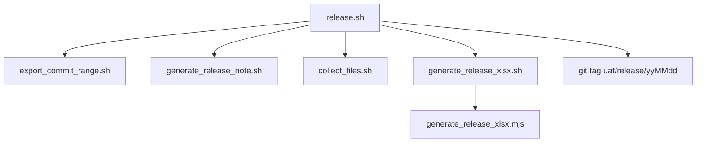

# MGB UAT 過版工具

本 repo 是兆豐（MGB）FEP 專案 **SIT → UAT 過版**用的本地工具集：一組 shell script 搭配一支 Node.js（`exceljs`）腳本，將指定 commit 區間的異動自動整理成過版交付包（Release Note、異動清單 CSV、扁平化檔案、以及「兆豐UAT異動項目」Excel）。

> 這是**流程腳本 repo**，不含 FEP 專案原始碼本身；所有腳本實際操作的對象是另一個 repo（環境變數 `MGBFEP_PROJECT_DIR` 指向的 `mgbfep` 專案）。

## 需求

- macOS（腳本以 zsh/bash 撰寫並在 macOS 上驗證）
- Git
- Node.js（供 `generate_release_xlsx.mjs` 使用 `exceljs` 產生 `.xlsx`；`node_modules` 為 gitignore，首次執行 `generate_release_xlsx.sh` 會自動 `npm install`）
- 本機已 clone 兆豐 FEP 專案（`mgbfep`），且目前分支為 `FEP_1-3_UAT`（或 `*SIT` 結尾分支）

## 快速開始

```bash
# 指定 MGBFEP 專案路徑（預設 $HOME/Repo/idea_clone/mgbfep）
export MGBFEP_PROJECT_DIR=/path/to/mgbfep

# 一般情境：接續上次 release.sh 自動打的 tag，不用帶參數
./release.sh

# 第一次執行 / 前次 tag 不存在時，手動指定前一次過版的 tag 或 commit
./release.sh uat/release/260703
```

執行完成後，交付包會產生在 `outputs/`（此目錄已加入 `.gitignore`，不會進版控）。

## 腳本總覽

| 腳本 | 用途 |
|---|---|
| [`release.sh`](release.sh) | **主流程**入口，依序呼叫下列子腳本並在最後自動打 tag |
| [`export_commit_range.sh`](export_commit_range.sh) | 匯出指定 commit 區間的異動檔案與 CSV |
| [`generate_release_note.sh`](generate_release_note.sh) | 依模組分組產生 Markdown Release Note |
| [`collect_files.sh`](collect_files.sh) | 將匯出的檔案扁平化收集，方便交付 |
| [`generate_release_xlsx.sh`](generate_release_xlsx.sh) | 依 `changes.csv` 產生「兆豐UAT異動項目」Excel（wrapper） |
| [`generate_release_xlsx.mjs`](generate_release_xlsx.mjs) | 實際產生 `.xlsx` 的 Node 邏輯（由上方 wrapper 呼叫，不直接手動執行） |



## 產出目錄結構（`outputs/`）

```
outputs/
├── changes.csv                              # 過版清單（generate_release_xlsx.sh 的輸入）
├── commits.csv                              # commit 清單
├── changes.patch                            # 完整 diff patch
├── export_files/                            # 保留目錄結構的原始檔案
├── files/                                   # 扁平化後的交付用檔案
├── FEP_RELEASE_NOTE_yyyy-mm-dd.md           # Release Note
└── yyyyMMdd-P1-3 兆豐UAT異動項目.xlsx        # 異動清單／設定檔／(資料庫異動)／模組更新
```

## 文件

- [`過版腳本使用說明.md`](過版腳本使用說明.md) — 各腳本參數、呼叫關係、xlsx 產生規則的詳細說明
- [`UAT過版流程說明.md`](UAT過版流程說明.md) — 完整過版作業流程（cherry-pick、Excel 核對、build.bat 驗證、打 tag 等）
- [`UAT過版程序.txt`](UAT過版程序.txt) — 原始過版程序文件

## 環境變數

| 變數 | 說明 | 預設值 |
|---|---|---|
| `MGBFEP_PROJECT_DIR` | 兆豐 FEP 專案（`mgbfep`）的 repo 路徑，所有 commit／tag 皆針對此 repo 操作 | `$HOME/Repo/idea_clone/mgbfep` |
