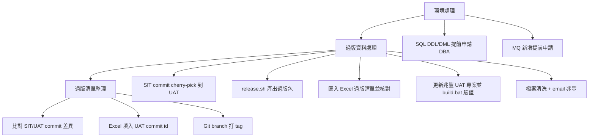

# 兆豐 FEP 專案 SIT → UAT 過版流程說明

> 依據 `UAT過版程序.txt` 整理，並對照本 repo 內的 shell 腳本與 MGBFEP 專案相關程式碼。

## 整體流程概觀

文件分三大階段：



---

## 一、環境處理（過版前準備）

| 步驟 | 說明 |
|------|------|
| SQL DDL/DML | 若有資料庫結構或資料異動，需**提早**提交兆豐 DBA，避免過版當天才發現衝突 |
| MQ 新增 | 若有新 Message Queue 設定，也需**提前申請** |

這是前置作業，與程式碼無直接關聯，但會影響 UAT 能否正常啟動。

---

## 二、過版資料處理（核心作業）

### 步驟 1：Git 合併 SIT → UAT

依據過版清單，將 SIT 的 commit **cherry-pick** 到 UAT。

- **分支命名**：`FEP_1-2_SIT`（開發測試）、`FEP_1-2_UAT`（兆豐 UAT）
- **方式**：優先用 **cherry-pick**（保留原始 commit message，方便追蹤）
- **衝突**：由 SD（Software Developer）處理

### 步驟 2：產出過版包（shell 腳本）

腳本位於本 repo 根目錄，需在 **Git repo root** 下執行（腳本會自動 `cd` 到 `git rev-parse --show-toplevel`）。

#### 腳本總覽

| 腳本 | 用途 | 呼叫方式 |
|------|------|----------|
| `release.sh` | **主流程**：一次完成匯出、Release Note、檔案收集 | `./release.sh <前一個過版 tag 或 commit>` |
| `export_commit_range.sh` | 匯出指定 commit 區間的變更檔案與 CSV | `./export_commit_range.sh <start> <end>` |
| `generate_release_note.sh` | 產生依模組分組的 Markdown Release Note | `./generate_release_note.sh <start_commit>` |
| `collect_files.sh` | 將 `export_files/` 排除 `src/test`／`source/fep/**` 下 `.properties`／檔名未變的二進位資源檔後收集到 `files/`（扁平化）與 `release_files/`（保留目錄結構）；`fep-release-note` 不排除，照常收集 | `./collect_files.sh`（需先執行匯出） |

> 原流程文件中的 `export_commit.sh` 對應實際檔名 **`export_commit_range.sh`**。

#### `release.sh` 執行流程

```bash
./release.sh <previous_release_tag_or_commit>
```

依序呼叫三支子腳本（`PREV_RELEASE` → `HEAD`）：

1. **`export_commit_range.sh`** — 匯出整個過版區間（若 `output/` 非空會詢問是否清空）
2. **`generate_release_note.sh`** — 補產 Release Note 文件
3. **`collect_files.sh`** — 排除 `src/test`／`source/fep/**` 下 `.properties`／檔名未變的二進位資源檔後收集檔案，方便交付（`fep-release-note` 不排除，照常收集；`files/` 扁平化 + `release_files/` 保留目錄結構）

#### `export_commit_range.sh` 實際邏輯

```bash
# 批次過版（release.sh 內部呼叫）
./export_commit_range.sh <prev_release_tag_or_commit> HEAD

# 單一 commit 補過（原流程 A：之前漏過的單一 commit）
./export_commit_range.sh <該 commit 的前一個 commit> <該 commit>
```

**主要行為**：

| 項目 | 說明 |
|------|------|
| 工作目錄 | 切換到 Git repo root，確保路徑一致 |
| 輸出目錄 | 與腳本同路徑下的 `output/`（非 `release-note/` 子目錄） |
| `changes.csv` | 欄位：`檔案名稱,檔案路徑,動作,Commit Message`；動作含新增/修改/刪除/重新命名/複製 |
| `commits.csv` | 欄位：`Commit,Author,Date,Message`；涵蓋 `START~1..END` 區間（含 START 本身） |
| `changes.patch` | `git diff START END` 完整 patch |
| `export_files/` | 保留原始目錄結構；刪除的檔案不匯出；其餘以 `git show END:path` 取 END 版本內容；**完整原始備份，不套用任何排除規則**（`src/test` 都還在；`fep-release-note` 本來就不排除） |

**檔案狀態處理**（`git diff --name-status -z`）：

- `A` → 新增、`M` → 修改、`D` → 刪除（不匯出實體檔）
- `R*` → 重新命名（取新檔名）
- `C*` → 複製（取新檔名）

#### `generate_release_note.sh` 產出

- 輸出：`output/FEP_RELEASE_NOTE_yyyy-mm-dd.md`
- 範圍：`START_COMMIT..HEAD`，**排除 merge commit**
- 依 `source/fep/` 下第三層路徑分組為 Module（例如 `fep-server`）
- 每個 Module 標題附統計：`(Added: N, Modified: N, Deleted: N, Renamed: N)`
- 每筆 commit 列出：短 hash、日期、subject，以及該 commit 的檔案變更清單

#### `collect_files.sh` 產出

- 來源：`output/export_files/`
- 複製前會先讀 `changes.csv`，套用 `release_exclude.mjs` 的排除規則（`src/test`、`source/fep/**` 下的 `.properties`、檔名未變的二進位資源檔（圖片／字型，動作＝修改），邏輯與異動清單/測試檔排除清單分頁共用）；`fep-release-note` 不在排除規則內，會照常收集（xlsx 另列「fep-release-note清單」分頁）；執行時會分別印出「排除前」「排除後」「files/ 收集後」「release_files/ 收集後」四個數字
- 同時輸出兩份，**用途不同、不能混用**：

  | 目錄 | 結構 | ⚠️ 用途 |
  |---|---|---|
  | `output/files/` | **扁平化**，僅保留檔名，同檔名會互相覆蓋 | 只適合肉眼核對檔名/數量，**不能拿來覆蓋客戶環境**（不同模組同名檔案，例如 `pom.xml`，扁平化後會互相蓋掉，蓋出來的內容是不確定的） |
  | `output/release_files/` | **保留原始目錄結構**（跟 `export_files/` 一致，只是已排除） | **實際交付／覆蓋客戶環境要用這份**，步驟5、步驟7都應該以這個目錄為準，不要再用未排除的 `export_files/` 手動清理 |

- `files/` 若「排除後」數量跟「收集後」數量不同，代表有檔名衝突（`release_files/` 保留目錄結構不會有這問題）
- 每次執行前會先清空 `output/files/`、`output/release_files/`，避免殘留上次執行的舊檔案

#### 完整 `output/` 目錄結構

```
output/
├── changes.csv          # 過版清單（匯入 Excel）
├── commits.csv          # commit 清單
├── changes.patch        # 完整 diff patch
├── export_files/        # 保留目錄結構的原始檔案（未排除，完整備份）
├── files/                # 扁平化後的檔案（已排除 src/test／properties／同檔名資源，fep-release-note 照常收集，僅供核對檔名）
├── release_files/        # 保留目錄結構、已排除 src/test／properties／同檔名資源，fep-release-note 照常收集 ← 實際交付用這份
└── FEP_RELEASE_NOTE_yyyy-mm-dd.md
```

**特殊情況**（原流程）：

- **A.** 單一 commit 補過：直接呼叫 `export_commit_range.sh <前一個 commit> <目標 commit>`（不必跑完整 `release.sh`，或手動補跑 `generate_release_note.sh` / `collect_files.sh`）
- **B.** 若僅異動單一檔案且有相依性問題，需人工整理

### 步驟 3：核對過版清單

1. 將產出的 `changes.csv` 匯入 Excel 過版清單
2. ⚠️ **`export_files/` 保留全部原始匯出檔案（未排除任何內容）**，跟 Excel「異動清單」分頁的數量不會 1:1 對應，因為異動清單只收 `source/fep/` 底下的異動，且 `fep-release-note` 改列在獨立的「fep-release-note清單」分頁（見下方「Excel 產出格式」表）。但 **`output/release_files/source/fep/` 的實際檔案數，應該要跟「異動清單」＋「fep-release-note清單」分頁的筆數總和完全一致**（三者共用同一份 `release_exclude.mjs` 排除規則：`src/test`、`source/fep/**` 下的 `.properties`、檔名未變的二進位資源檔；`fep-release-note` 不排除），如果對不起來就是排除規則跑掉了，要回頭檢查。`output/files/`（扁平化）因為同名檔案會互相覆蓋，數量會比 `release_files/` 少，不能拿來核對筆數
3. 可用以下 Windows 指令列出檔案（路徑請依實際過版日期目錄調整）：

```cmd
:: 僅檔名（不含路徑）
for /r "C:\Users\essences\Desktop\Workspace\版本更新紀錄\P1-3_UAT\20260817\release-note\export_files\source\fep" %f in (*) do @echo %~nxf

:: 完整路徑 + 檔名
dir /s /b /a-d "C:\Users\essences\Desktop\Workspace\版本更新紀錄\P1-3_UAT\20260817\release-note\export_files\source\fep"
```

> 腳本預設輸出至 repo 內 `output/export_files/`；若交付前會複製到「版本更新紀錄」工作目錄，核對時以實際交付路徑為準。

### 步驟 4：Config 異動處理

若有 config 異動：

- 將相關資訊放置到「參數檔異動頁面」
- 將完整版 config 檔案集中放置，供客戶參考

### 步驟 5：Test 程式檔案處理

> ⚠️ 此步驟自 2026/07 起已改為**程式自動排除**（`release_exclude.mjs`，同時被 `generate_release_xlsx.mjs` 與 `collect_files.sh` 共用），邏輯比照 `../mgb-vul/RemoveTest.ps1`，不再需要人工逐一檢查。以下為改動前的人工紀錄，僅供對照。

過版包中不應含一般 UT，但以下**必須保留**（截至 2026/03/24，人工作業時期紀錄）：

| 類型 | 保留項目 |
|------|----------|
| RemoveVersion | fep-batch, fep-server, fep-service, fep-web 四個模組 |
| fep-batch-task | `AssemblyPropFileGenerator.java`, `ReleaseNoteGenerator.java` |

現行自動化排除規則（`release_exclude.mjs`）：

- 排除路徑：`src/test/`（比照 `../mgb-vul/RemoveTest.ps1` 的 `-TestPathPattern`）
- 保留例外（檔名含以下關鍵字，不分大小寫）：`BatchTaskUtil`、`Generator`、`RemoveVersion`（`Generator` 原本是 `AssemblyPropFileGenerator`、`ReleaseNoteGenerator` 兩個具體檔名，因為都含有 `Generator` 字串、可以被這個較寬的關鍵字涵蓋，故合併簡化為單一關鍵字，順便涵蓋日後其他命名含 `Generator` 的 batch task 工具類別）
- ⚠️ **與上面人工紀錄的差異**：`BatchTaskUtil` 是比照 `RemoveTest.ps1` 預設值新增的保留關鍵字，過往人工紀錄的保留清單中沒有列出這一項，過版時請留意確認是否為新增的保留規則，或是先前人工作業就已遺漏。

**⚠️ 交付方式的重大限制（造成過至少一次客戶端編譯失敗的事故）**：`collect_files.sh` / `export_commit_range.sh` 的交付方式是把新增/修改的檔案**疊加覆蓋**到客戶既有環境，**不會主動刪除客戶端任何檔案**——包含 git 上真的被刪除的檔案、以及現在被自動排除、不再出現在交付包裡的 `src/test` 檔案。早期人工排除 `src/test` 時若未清乾淨，客戶環境可能還留有舊測試檔案；這些舊檔案不會因為改用程式排除而被自動清掉。若後續 main 原始碼異動使舊測試檔引用的 API 被修改/移除，客戶端會編譯失敗。

**因應方式**：`generate_release_xlsx.mjs` 產出的 xlsx 若偵測到本次 commit 範圍有 `src/test` 異動（含新增/修改/刪除），會額外產生「**測試檔排除清單(需人工確認)**」分頁，列出所有被排除的路徑與異動類型。**每次過版都要對照這頁清單，請客戶依清單自行確認並手動刪除環境中對應的舊測試檔案**，不能只依賴交付包內容。

**⚠️ 實際打包/覆蓋客戶環境請用 `output/release_files/`**（保留目錄結構、已套用排除規則），不要再用未排除的 `output/export_files/` 手動整理——這正是先前造成客戶端編譯失敗的原因：`export_files/` 內容完整未過濾，若步驟7憑印象手動清 test 檔沒清乾淨，就會把 `src/test` 檔案一起疊加到客戶環境。改用 `release_files/` 後，程式已保證不含 `src/test`，不用再手動判斷哪些該留、哪些該刪（`fep-release-note` 本來就要交付，不在排除之列）。

### 步驟 6：更新兆豐 UAT 專案並建置

將過版檔案套入兆豐 UAT 版專案，執行 `build.bat` 驗證：

**路徑**：`source/fep/build.bat`

```bat
@echo off
SET JAVA_HOME=D:/Java/ibm-semeru-open-jdk_x64_windows_17.0.5_8_openj9-0.35.0
SET MAVEN_HOME=D:/Development/apache-maven-3.8.5
SET PATH=%PATH%;%JAVA_HOME%/bin;%MAVEN_HOME%/bin
call mvn clean install -Dmaven.repo.local=E:/maven/repository -f pom.xml
call mvn clean install -Dmaven.repo.local=E:/maven/repository -pl fep-web -Pwar
```

**特殊注意事項**：

| 情況 | 處理方式 |
|------|----------|
| fep-web.war 異動 | 建議先放到 29 測試環境確認能否啟動 |
| enclib 異動 | 需先在自家 UAT branch `enclib/fep-enclib` 打包，取得 `fep-enclib.jar` 後放到 `source/fep/fep-enchelper/lib/` |

**enclib JAR 可能來源**：

1. `enclib/fep-enclib/target/fep-enclib-1.0.0.jar`
2. `source/fep/fep-enchelper/lib/fep-enclib.jar`
3. `source/fep-assembly-library/fep-enclib.jar`
4. 隨過版清單提供給兆豐，包版前預先放到 `source/fep/fep-enchelper/lib/`

### 步驟 7：檔案清洗 + Email 兆豐

最後清理過版包（移除不必要檔案），email 給兆豐做正式紀錄。

> ⚠️ 打包來源請用 `output/release_files/`（已排除 `src/test`，保留目錄結構；`fep-release-note` 照常收集），不要用 `output/export_files/`（未排除的完整原始備份）手動清理——手動清理容易漏，是先前造成客戶端編譯失敗的根因。

---

## 三、過版清單整理（事後追蹤）

### Git 指令：比較 SIT / UAT 差異

重點：**`git cherry` 比的是「內容」，不是「歷史」**。

| 指令 | 意義 |
|------|------|
| `git cherry -v FEP_1-2_UAT FEP_1-2_SIT \| grep '^+'` | SIT 有、UAT **還沒有**的 commit（內容層級） |
| `git cherry -v FEP_1-2_UAT FEP_1-2_SIT \| grep '-'` | SIT 的 commit **內容已在 UAT**（含 cherry-pick、rebase、patch 相同） |
| `git log FEP_1-2_UAT..FEP_1-2_SIT --oneline` | SIT 有但 UAT **歷史上沒有**的 commit（可能漏算 cherry-pick） |
| `git log FEP_1-2_UAT..FEP_1-2_SIT --pretty=format:"%h %an %ad %s" --date=short` | 同上，含 author、date（可能不包含 cherry-pick、rebase、squash merge） |

**實用組合**（列出未進 UAT 的 commit 詳情）：

```bash
git cherry -v FEP_1-2_UAT FEP_1-2_SIT | grep '^+' | \
  awk '{print $2}' | \
  xargs -I {} git show -s --format="%h%x09%an%x09%ad%x09%s" --date=short {}
```

輸出欄位：commit hash、author、date、commit message。

### 後續步驟

1. 匯入 Excel，篩出未進 UAT 的項目
2. 依 commit message 在 UAT branch 找對應 commit id
3. 依 SIT commit 查找線上過版清單，填入 UAT commit id，並更新過版日期
4. 在 Git branch **打 tag** 紀錄本次過版

---

## 四、專案中相關程式碼

### 1. `RemoveVersion.java` — 移除 JAR 版本號

**模組**：fep-batch、fep-server、fep-service、fep-web

**路徑範例**：`source/fep/fep-server/src/test/java/com/syscom/fep/server/build/RemoveVersion.java`

**邏輯**：將 `fep-xxx-1.0.0.jar` 重新命名為 `fep-xxx.jar`。

```java
// 定位到 WEB-INF/lib
File lib = new File(target, "/fep-server/WEB-INF/lib");
// 匹配 fep-*-1.0.0.jar
FileFilter filefilter = new RegexFileFilter("^fep-(.*)-1.0.0.jar", IOCase.INSENSITIVE);
// 重新命名：去掉 -1.0.0
Files.move(sourceFile.toPath(), targetFile.toPath(), StandardCopyOption.REPLACE_EXISTING);
```

**用途**：兆豐部署環境可能不帶版本號的 JAR 名稱，此 UT 在 build 後自動處理。

### 2. `AssemblyPropFileGenerator.java` — 自動產生 batch task 組態

**模組**：fep-batch-task

**路徑**：`source/fep/fep-batch-task/src/test/java/com/syscom/fep/batch/task/util/AssemblyPropFileGenerator.java`

**邏輯**：

1. 掃描 `classes/com/syscom/fep/batch/task/` 下所有 batch task class
2. 產生 `assembly-prop-batch-tasks=TaskA,\TaskB,\...`
3. 寫入 `fep-config/src/main/assembly/fep-batch-task/assembly-batch-task-prop.properties`

**用途**：新增 batch task 時，自動更新 assembly 組態，避免手動維護。

### 3. `ReleaseNoteGenerator.java` — 自動產生 Release Note 模板

**模組**：fep-batch-task

**路徑**：`source/fep/fep-batch-task/src/test/java/com/syscom/fep/batch/task/util/ReleaseNoteGenerator.java`

**邏輯**：

1. 掃描 batch task class
2. 為每個 task 產生 `fep-batch-task-{TaskName}.txt`
3. 放到 `fep-release-note/` 目錄

**用途**：為每個 batch task 建立 release note 模板，供過版文件填寫。

### 4. Maven Surefire 設定 — 保留特定 UT

**fep-batch-task**（`pom.xml`）：

```xml
<configuration>
    <includes>
        <include>**/AssemblyPropFileGenerator.java</include>
        <include>**/ReleaseNoteGenerator.java</include>
    </includes>
</configuration>
```

**fep-batch / fep-server / fep-service / fep-web** 的 `pom.xml` 也有類似設定，只執行 `RemoveVersion.java`。

---

## 五、流程與工具對照表

| 文件步驟 | 相關工具 / 程式 |
|----------|-----------------|
| cherry-pick SIT → UAT | Git 指令 |
| 產出過版包（主流程） | `release.sh` |
| 匯出 commit 區間檔案 | `export_commit_range.sh` → `changes.csv`、`commits.csv`、`changes.patch`、`export_files/` |
| 產生 Release Note | `generate_release_note.sh` → `FEP_RELEASE_NOTE_yyyy-mm-dd.md` |
| 扁平化交付檔案 | `collect_files.sh` → `output/files/` |
| 建置驗證 | `source/fep/build.bat` → Maven clean install |
| 移除 JAR 版本號 | `RemoveVersion.java`（四模組） |
| 更新 batch task 組態 | `AssemblyPropFileGenerator.java` |
| 產生 release note 模板 | `ReleaseNoteGenerator.java`（batch task UT，與 shell 的 `generate_release_note.sh` 不同） |
| enclib 打包 | `enclib/fep-enclib/build.bat` |
| 比對 commit 差異 | `git cherry` / `git log` 指令 |

---

## 六、過版檢查清單（Checklist）

### 過版前

- [ ] SQL DDL/DML 已提交兆豐 DBA
- [ ] MQ 新增已提前申請
- [ ] 過版清單已確認（SIT commit 列表）

### 過版中

- [ ] SIT commit 已 cherry-pick 到 UAT（衝突已解）
- [ ] `release.sh` 已產出完整 `output/`（或單一 commit 已用 `export_commit_range.sh` 補過）
- [ ] `changes.csv` / `commits.csv` 與 `export_files/` 數量、路徑一致
- [ ] `FEP_RELEASE_NOTE_yyyy-mm-dd.md` 已產生並檢視
- [ ] Config 異動已整理到參數檔異動頁面
- [ ] 不必要 UT 已移除（保留 RemoveVersion、Generator 類）
- [ ] 兆豐 UAT 專案 `build.bat` 建置成功
- [ ] fep-web.war 已在 29 環境驗證（若有異動）
- [ ] enclib JAR 已更新（若有異動）

### 過版後

- [ ] 過版包已清洗並 email 兆豐
- [ ] 線上過版清單已更新 UAT commit id、過版日期
- [ ] Git branch 已打 tag
