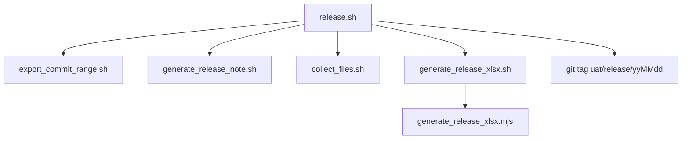

# 過版腳本使用說明

> 說明本 repo 內用於產出兆豐 UAT 過版包的所有腳本、中介檔案，以及彼此的呼叫關係。
> 完整過版「作業流程」（cherry-pick、Excel 核對、build.bat 驗證…）請參考 [`UAT過版流程說明.md`](UAT過版流程說明.md)；本文件只聚焦在**程式怎麼用**。

## 一、整體流程



`release.sh` 是唯一需要手動執行的入口，其餘腳本都會被它依序呼叫；也可以單獨呼叫各子腳本做局部補作業。

---

## 二、`release.sh`（主流程）

```bash
./release.sh [前一個過版 tag 或 commit]
```

| 參數 | 是否必填 | 說明 |
|------|----------|------|
| `previous_release_tag_or_commit` | 否 | 前一次過版的 commit 或 tag。**省略時**會自動到 `MGBFEP_PROJECT_DIR` 的 repo 裡尋找符合 `uat/release/yyMMdd`（6 碼日期）格式的 tag，取排序最新的一個當作前次過版點；若找不到任何符合格式的 tag，腳本會報錯並結束 |

**環境變數**：`MGBFEP_PROJECT_DIR` — 兆豐 FEP 專案（`mgbfep`）的 repo 路徑，預設 `$HOME/Repo/idea_clone/mgbfep`。所有 commit、tag 都是對這個 repo 操作，不是對 `MGB_UAT` 這個腳本所在的 repo。

**執行步驟**：

1. `export_commit_range.sh <前次> HEAD` — 匯出整個過版區間的檔案與 CSV
2. `generate_release_note.sh <前次>` — 產生 Markdown Release Note
3. `collect_files.sh` — 扁平化收集交付檔案
4. `generate_release_xlsx.sh` — 依 `changes.csv` 產生「兆豐UAT異動項目」xlsx
5. 在 `MGBFEP_PROJECT_DIR` 的 `HEAD` 上打 tag `uat/release/<今天 yyMMdd>`（若 tag 已存在則跳過，不會報錯），做為**下一次**執行 `release.sh` 時自動偵測的前次過版點

> 因為第 5 步會自動打 tag，正常情況下往後執行 `release.sh` **不需要再帶參數**，腳本會自己接續上一次的 tag。

---

## 三、子腳本與中介檔案

### 1. `export_commit_range.sh` — 匯出 commit 區間

```bash
./export_commit_range.sh <start_commit_or_tag> <end_commit>
```

- 切換到 `MGBFEP_PROJECT_DIR` 的 repo root 執行，確保檔案路徑一致
- 若 `outputs/` 已有內容，會詢問是否清空（`y` 才會清空並繼續）
- 產出：

| 檔案 / 目錄 | 內容 |
|---|---|
| `outputs/changes.csv` | 欄位：`檔案名稱,檔案路徑,動作,Commit Message`；動作為新增／修改／刪除／重新命名／複製 |
| `outputs/commits.csv` | 欄位：`Commit,Author,Date,Message`，涵蓋 `START~1..END`（含 START 本身） |
| `outputs/changes.patch` | `git diff START END` 的完整 patch |
| `outputs/export_files/` | 保留原始目錄結構的檔案內容（`git show END:path`）；刪除的檔案不匯出 |

`changes.csv` 是後續 `generate_release_xlsx.sh` 的**唯一輸入來源**。

### 2. `generate_release_note.sh` — 產生 Release Note

```bash
./generate_release_note.sh <start_commit>
```

- 範圍 `START..HEAD`，排除 merge commit
- 依 `source/fep/<module>/...` 第三層路徑分組，模組標題附加 `(Added/Modified/Deleted/Renamed)` 統計
- 產出：`outputs/FEP_RELEASE_NOTE_yyyy-mm-dd.md`（日期為執行當天）

### 3. `collect_files.sh` — 扁平化收集檔案

```bash
./collect_files.sh
```

- 來源：`outputs/export_files/`（需先執行過 `export_commit_range.sh`）
- 目標：`outputs/files/`，去掉目錄結構、只留檔名；同檔名會互相覆蓋
- 會印出收集前後檔案數量，數量不同代表有檔名衝突（同名不同路徑的檔案互相覆蓋）

### 4. `generate_release_xlsx.sh` — 產生兆豐 UAT 異動項目 xlsx（wrapper）

```bash
./generate_release_xlsx.sh [changes.csv 路徑]
```

- 預設讀取 `outputs/changes.csv`（可傳自訂路徑覆蓋，例如要重跑舊資料）
- 第一次執行時，若 `node_modules/exceljs` 不存在會自動執行 `npm install`
- 呼叫 `generate_release_xlsx.mjs` 實際產生檔案
- 輸出檔名：`outputs/<今天 yyyyMMdd>-P1-2 兆豐UAT異動項目.xlsx`（日期格式與檔名比照 `outputs.0702/20260623-P1-2 兆豐UAT異動項目.xlsx` 這類既有範例檔）

### 5. `generate_release_xlsx.mjs` — xlsx 產生邏輯（Node + exceljs）

```bash
node generate_release_xlsx.mjs <changes.csv> <輸出.xlsx>
```

不會直接手動呼叫，由 `generate_release_xlsx.sh` 帶入正確路徑執行。邏輯移植自先前用 Codex 產生同名 xlsx 時所寫的 `build_mgb_uat_0702.mjs`（見 `.codex_spreadsheet_work/`、`outputs.0702/0702_work/`），只是把當時依賴 Codex 專屬的 `@oai/artifact-tool` 套件改用一般可安裝的 `exceljs` 重寫，格式與規則維持一致：

會依 `changes.csv` 產生以下 sheet：

| Sheet | 內容 | 篩選規則 |
|---|---|---|
| **異動清單** | 逐檔列出 Index／修改檔案／位置／異動類型／修改內容 | 排除「刪除」；副檔名限 `.java .xml .html .js .properties .txt .jar .sql .css`；排除 `source/SIT套config`、`source/開發套config`、`source/fep/fep-release-note` 路徑 |
| **設定檔** | UAT config 檔案異動，附主機資訊 | 只取 `source/UAT套config/` 下且非刪除的項目；依路徑含 `UAT_AP1`/`UAT_AP2` 判斷主機 IP，依路徑含 `/fep-web/was_config` 或 `/config` 判斷部署路徑 |
| **資料庫異動**（有 `.sql` 檔才會產生） | SQL 檔案異動清單 | 副檔名為 `.sql` |
| **模組更新** | 依 `source/fep/<module>` 分組統計異動檔案數與異動類型 | 排除刪除、排除 `.sql`；模組名稱取路徑第三層並轉大寫 |

### 6. `package.json` / `node_modules/`

- `package.json` 宣告 `exceljs` 這個 npm 相依套件，供 `generate_release_xlsx.mjs` 產生 `.xlsx`
- `node_modules/` 由 `generate_release_xlsx.sh` 第一次執行時自動 `npm install` 產生，已加入 `.gitignore`，不需要、也不應該進版控

---

## 四、`outputs/` 完整目錄結構

```
outputs/
├── changes.csv                              # 過版清單（generate_release_xlsx.sh 的輸入）
├── commits.csv                              # commit 清單
├── changes.patch                            # 完整 diff patch
├── export_files/                            # 保留目錄結構的原始檔案
├── files/                                   # 扁平化後的交付用檔案
├── FEP_RELEASE_NOTE_yyyy-mm-dd.md           # Release Note
└── yyyyMMdd-P1-2 兆豐UAT異動項目.xlsx        # 異動清單／設定檔／(資料庫異動)／模組更新
```

---

## 五、常見用法

```bash
# 一般情境：接續上次 release.sh 自動打的 tag，不用帶參數
./release.sh

# 指定前次過版點（例如第一次執行、或前次 tag 不存在）
./release.sh v1.2.2
./release.sh 3a1b2c3

# 只想重新產生 xlsx（例如手動改過 changes.csv 後）
./generate_release_xlsx.sh

# 針對舊的 changes.csv 重新產生 xlsx
./generate_release_xlsx.sh outputs.0702/changes.csv
```
