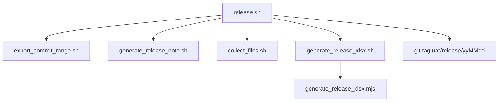

# 過版腳本使用說明

> 說明本 repo 內用於產出兆豐 UAT 過版包的所有腳本、中介檔案，以及彼此的呼叫關係。
> 完整過版「作業流程」（cherry-pick、Excel 核對、build.bat 驗證…）請參考 [`UAT過版流程說明.md`](UAT過版流程說明.md)；本文件只聚焦在**程式怎麼用**。

## 一、整體流程



`release.sh` 是唯一需要手動執行的入口，其餘腳本都會被它依序呼叫；也可以單獨呼叫各子腳本做局部補作業。

---

## 二、`release.sh`（主流程）

```bash
./release.sh [前一個過版 tag 或 commit]
```

| 參數 | 是否必填 | 說明 |
|------|----------|------|
| `previous_release_tag_or_commit` | 否 | 前一次過版的 commit 或 tag。**省略時**會依「目前分支結尾」決定要找的 tag 前綴（見下方「分支與 tag 前綴對應」），到 `MGBFEP_PROJECT_DIR` 的 repo 裡尋找符合 `<前綴>/yyMMdd`（6 碼日期）格式、且是目前 HEAD 祖先的 tag，取名稱最新的一個當作前次過版點；若找不到符合條件的 tag，腳本會報錯並結束 |

**環境變數**：`MGBFEP_PROJECT_DIR` — 兆豐 FEP 專案（`mgbfep`）的 repo 路徑，預設 `$HOME/Repo/idea_clone/mgbfep`。所有 commit、tag 都是對這個 repo 操作，不是對 `MGB_UAT` 這個腳本所在的 repo。

**分支檢查**：腳本最前面定義 `EXPECTED_BRANCH="FEP_1-3_UAT"`，執行時會檢查 `MGBFEP_PROJECT_DIR` 專案目前所在分支。若不是這個分支（例如不小心切到 SIT 分支），會印出警告並詢問是否仍要繼續（`y` 才會繼續，其餘輸入一律取消，不會動到 `outputs/` 或建立 tag）。

**分支與 tag 前綴對應**：依目前分支名稱的**結尾**判斷（`case "$CURRENT_BRANCH" in *UAT) ... ;; *SIT) ... ;; esac`）：

| 分支結尾 | tag 前綴 | 找前次 tag / 建立新 tag |
|---|---|---|
| `UAT` | `uat/release` | 例如 `uat/release/260703` |
| `SIT` | `sit/release` | 例如 `sit/release/260703` |
| 其他 | （無） | 不會自動找 tag（需手動指定前次 commit），流程跑完也不會建立 tag |

**候選 tag 必須是目前 HEAD 的祖先**：只會考慮同一條分支歷史上的 tag，避免誤選到「其他分支上建立、名稱日期比較新，但實際不在目前分支歷史裡」的 tag（例如不小心在 SIT 分支跑過一次、之後切回 UAT 分支，UAT 分支歷史不會採用 SIT 那次建立的 tag）。

**執行步驟**：

1. `export_commit_range.sh <前次> HEAD` — 匯出整個過版區間的檔案與 CSV
2. `generate_release_note.sh <前次>` — 產生 Markdown Release Note
3. `collect_files.sh` — 排除 `src/test` 後收集交付檔案（`fep-release-note` 不排除，照常收集；`files/` 扁平化 + `release_files/` 保留目錄結構）
4. `generate_release_xlsx.sh` — 依 `changes.csv` 產生「兆豐UAT異動項目」xlsx
5. 依目前分支決定的 tag 前綴，在 `MGBFEP_PROJECT_DIR` 的 `HEAD` 上打 tag `<前綴>/<今天 yyMMdd>`（若 tag 已存在則跳過，不會報錯；分支非 UAT/SIT 結尾則不建立），做為**下一次**執行 `release.sh` 時自動偵測的前次過版點

> 因為第 5 步會自動打 tag，正常情況下往後執行 `release.sh` **不需要再帶參數**，腳本會自己接續上一次的 tag（只要分支結尾是 UAT 或 SIT）。

---

## 三、子腳本與中介檔案

### 1. `export_commit_range.sh` — 匯出 commit 區間

```bash
./export_commit_range.sh <start_commit_or_tag> <end_commit>
```

- 切換到 `MGBFEP_PROJECT_DIR` 的 repo root 執行，確保檔案路徑一致
- 若 `outputs/` 已有內容，會詢問是否清空（`y` 才會清空並繼續）
- 產出：

| 檔案 / 目錄 | 內容 |
|---|---|
| `outputs/changes.csv` | 欄位：`檔案名稱,檔案路徑,動作,Commit Message`；動作為新增／修改／刪除／重新命名／複製 |
| `outputs/commits.csv` | 欄位：`Commit,Author,Date,Message`，涵蓋 `START~1..END`（含 START 本身） |
| `outputs/changes.patch` | `git diff START END` 的完整 patch |
| `outputs/export_files/` | 保留原始目錄結構的檔案內容（`git show END:path`）；刪除的檔案不匯出；**這裡不套用任何排除規則，是完整原始備份**，`src/test` 等要排除的內容都還在，排除規則只在 `collect_files.sh` 的輸出與 xlsx 才會生效（`fep-release-note` 不排除，檔案照常收集、xlsx 另列分頁） |

`changes.csv` 是後續 `generate_release_xlsx.sh` 的**唯一輸入來源**。

### 2. `generate_release_note.sh` — 產生 Release Note

```bash
./generate_release_note.sh <start_commit>
```

- 範圍 `START..HEAD`，排除 merge commit
- 依 `source/fep/<module>/...` 第三層路徑分組，模組標題附加 `(Added/Modified/Deleted/Renamed)` 統計
- 產出：`outputs/FEP_RELEASE_NOTE_yyyy-mm-dd.md`（日期為執行當天）

### 3. `collect_files.sh` — 收集並排除檔案（扁平化 + 保留目錄結構兩種輸出）

```bash
./collect_files.sh
```

- 來源：`outputs/changes.csv` + `outputs/export_files/`（需先執行過 `export_commit_range.sh`）
- 收集前先呼叫 `list_collect_files.mjs <changes.csv> <export_files>`，套用 `release_exclude.mjs` 的排除規則（`src/test`，含關鍵字例外；`source/fep/**` 下的 `.properties`；檔名未變的二進位資源檔，動作＝修改），只收集排除後的清單，跟 xlsx「異動清單」「測試檔排除清單」共用同一份規則。`fep-release-note` 不在排除規則內，會照常收集（xlsx 則另列「fep-release-note清單」分頁，不混進「異動清單」）。之所以改成讀 `changes.csv` 驅動（而非單純掃 `export_files` 目錄），是因為「同檔名資源不列入」這條規則需要「動作」欄位，單純掃檔案系統拿不到。⚠️ `source/fep/` 底下不含這三類排除的檔案數，會跟 xlsx「異動清單」筆數一致；`enclib/`、`tools/`、`source/UAT套config/` 等 xlsx 沒收的部分，這裡仍會完整保留（異動清單只是報表範圍窄，不代表不用交付）
- 同時輸出兩種結果（每次執行都會先清空重建，不會殘留上次結果）：

  | 目錄 | 結構 | 用途 |
  |---|---|---|
  | `outputs/files/` | **扁平化**，去掉目錄結構、只留檔名；同檔名會互相覆蓋 | 純粹瀏覽/核對檔名用，**不要拿來覆蓋客戶環境**（同名不同模組的檔案會互相覆蓋，例如不同模組下都有 `pom.xml`） |
  | `outputs/release_files/` | **保留原始目錄結構**（跟 `export_files/` 一致，只是已排除） | **實際交付、覆蓋客戶環境請用這份**，不會有檔名衝突 |

- 會印出「排除前」「排除後」「files/ 收集後」「release_files/ 收集後」四個數量；`files/` 的數量若比「排除後」少，代表有檔名衝突（同名不同路徑互相覆蓋，`release_files/` 因為保留目錄不會有這個問題，兩者數量應相等）

### 4. `generate_release_xlsx.sh` — 產生兆豐 UAT 異動項目 xlsx（wrapper）

```bash
./generate_release_xlsx.sh [changes.csv 路徑]
```

- 預設讀取 `outputs/changes.csv`（可傳自訂路徑覆蓋，例如要重跑舊資料）
- 第一次執行時，若 `node_modules/exceljs` 不存在會自動執行 `npm install`
- 呼叫 `generate_release_xlsx.mjs` 實際產生檔案
- 輸出檔名：`outputs/<今天 yyyyMMdd>-P1-2 兆豐UAT異動項目.xlsx`（日期格式與檔名比照 `outputs.0702/20260623-P1-2 兆豐UAT異動項目.xlsx` 這類既有範例檔）

### 5. `generate_release_xlsx.mjs` — xlsx 產生邏輯（Node + exceljs）

```bash
node generate_release_xlsx.mjs <changes.csv> <輸出.xlsx>
```

不會直接手動呼叫，由 `generate_release_xlsx.sh` 帶入正確路徑執行。邏輯移植自先前用 Codex 產生同名 xlsx 時所寫的 `build_mgb_uat_0702.mjs`（見 `.codex_spreadsheet_work/`、`outputs.0702/0702_work/`），只是把當時依賴 Codex 專屬的 `@oai/artifact-tool` 套件改用一般可安裝的 `exceljs` 重寫，格式與規則維持一致：

會依 `changes.csv` 產生以下 sheet：

| Sheet | 內容 | 篩選規則 |
|---|---|---|
| **異動清單** | 逐檔列出 Index／修改檔案／位置／異動類型／修改內容 | 排除「刪除」；**只收 `source/fep/` 底下的異動**（`enclib/fep-enclib`、`tools/fep-mock-server` 等不屬於實際交付原始碼，不列入）；**不限副檔名**（`.png`／`.eot`／`.ttf`／`.woff`／`.woff2` 等靜態資源都會列出），但有兩個例外：① `.properties`（一律不列，一般 resource properties 隨模組整包部署不需單獨列出，`source/UAT套config/` 環境設定檔則已在「設定檔」頁單獨列出）；② **圖片／字型等二進位資源檔且動作＝「修改」（檔名沒變）也不列**——只有動作是「新增」或「重新命名」（檔名真的不同）才列入，避免整包重新輸出的資源檔（例如套件升級整批換新）洗版異動清單，判斷邏輯見 `release_exclude.mjs` 的 `isUnchangedResourceFile`（副檔名：`.png .jpg .jpeg .gif .bmp .ico .svg .eot .ttf .woff .woff2 .otf .map`）；排除 `source/SIT套config`、`source/開發套config` 路徑；排除路徑中含有 `fep-release-note` 字串的異動（不代表不交付，改列在下面「fep-release-note清單」分頁）；排除路徑包含 `src/test/` 的測試程式碼（檔名含 `BatchTaskUtil`、`Generator`、`RemoveVersion` 關鍵字者例外保留，比照 `../mgb-vul/RemoveTest.ps1`）。⚠️ **異動清單筆數＋fep-release-note清單筆數，應等於 `outputs/release_files/source/fep/` 下的實際檔案數**（`collect_files.sh` 改用 `list_collect_files.mjs` 讀 `changes.csv` 驅動，跟異動清單共用同一份 `release_exclude.mjs`，確保文件與檔案數量同步） |
| **設定檔** | `source/UAT套config/` 下的 properties 部署異動，附主機資訊 | 非刪除且副檔名為 `.properties`；僅接受路徑落在 `source/UAT套config/` 下且屬於 `.../config`（→ 部署路徑 `/fep/fep-app/config`）或 `.../fep-web/was_config`（→ 部署路徑 `/fep/fep-web/was_config`）兩種，其餘（SIT套config、開發套config、`source/fep/**` 內的一般 resource properties 等）一律略過不列入任何 sheet；因 UAT AP1/AP2 為同步部署的備份機，同一支檔案在兩台上的異動會合併成一列，主機欄位固定列出兩台（`UFEPAP01`、`UFEPAP02`），僅帳號／路徑會因類型而異；修改內容內的「完整檔案路徑」直接取「路徑」欄+「修改檔案」欄相加而成（例如 `/fep/fep-app/config/application-service-appmon.properties`），不再列原始 commit 路徑 |
| **測試檔排除清單(需人工確認)**（有 `src/test` 異動才會產生） | 列出這次 commit 範圍內 `src/test/` 路徑下**所有**異動（新增／修改／刪除都列，不像異動清單那樣先濾掉「刪除」），未套用副檔名白名單 | 路徑符合 `src/test/`（`isTestPath`）且檔名不含 `BatchTaskUtil`、`AssemblyPropFileGenerator`、`ReleaseNoteGenerator`、`RemoveVersion` 關鍵字（`isKeptTestFile`）者列入；⚠️ **重要**：交付方式是把新增/修改檔案疊加到客戶既有環境，不會主動刪除客戶端任何檔案（含這裡列出的、git 上真的被刪除的 test 檔）。早期人工排除 `src/test` 時代若未清乾淨，客戶環境可能還留有舊 test 檔案；本次交付包不會再更新/清除它們，若後續 main 原始碼異動導致這些舊 test 檔引用的 API 被改掉，會造成客戶端編譯失敗（已發生過一次事故）。**每次交付都要對照這頁清單，請客戶自行確認並手動刪除環境中對應的舊檔案。** |
| **fep-release-note清單**（有 `fep-release-note` 異動才會產生） | 逐檔列出 Index／修改檔案／位置／異動類型／修改內容，欄位格式與「異動清單」相同 | 排除「刪除」；路徑含 `fep-release-note` 字串（`isFepReleaseNotePath`）者列入。`fep-release-note` 檔案本身**不再排除**，會照常收集進 `files/`／`release_files/`，只是文件上跟一般原始碼異動分開列，方便對照 |
| **資料庫異動**（有 `.sql` 檔才會產生） | SQL 檔案異動清單 | 副檔名為 `.sql` |
| **模組更新** | 兩部分組成：① 封裝檔／特例整包更新列 ② 一般原始碼模組列 | 見下方說明 |

**模組更新頁籤的判斷邏輯**（`generate_release_xlsx.mjs`）— 依「修改檔案」（模組）判斷：

1. **`fep-web`**：來源檔案固定 `fep-web.war`，更新說明固定「更新Web」。
2. **`fep-batch-task`**：來源檔案固定 `/fep-assembly-batch-task`（因為實際是每個 batch task 各自一個 jar，沒有單一封裝檔），更新說明固定「底下所有task jar」。
3. **其他模組**：先判斷來源檔案——若是 `PACKAGE_DEFS` 定義的封裝 tar.gz（見下表），更新說明固定「全模組更新」；若不是 tar.gz（一般原始碼模組，來源檔案維持 `source/fep/<module>`），更新說明**留空白**，不再列檔案數差異。

  兆豐 UAT 專案實際部署的封裝 tar.gz（`PACKAGE_DEFS`，已用 `MGBFEP_PROJECT_DIR` 專案的 pom.xml / assembly 設定核對過）：

  | Server | 封裝檔（來源檔案） | 對應 Maven 模組 |
  |---|---|---|
  | FEP-SERVER-ATM | `fep-server-bin-atm.tar.gz` | `fep-server`（5 種變種全列：atm/fisc/mb/hce/lateresponse） |
  | FEP-SERVER-FISC | `fep-server-bin-fisc.tar.gz` | `fep-server` |
  | FEP-SERVER-MB | `fep-server-bin-mb.tar.gz` | `fep-server` |
  | FEP-SERVER-HCE | `fep-server-bin-hce.tar.gz` | `fep-server` |
  | FEP-SERVER-LATERESPONSE | `fep-server-bin-lateresponse.tar.gz` | `fep-server` |
  | FEP-SERVICE-APPMON | `fep-service-bin-appmon.tar.gz` | `fep-service` |
  | FEP-SERVICE-EMS | `fep-service-bin-ems.tar.gz` | `fep-service` |
  | FEP-SERVICE-CBSTIMEOUTRERUN | `fep-service-bin-cbstimeoutrerun.tar.gz` | `fep-service` |
  | FEP-BATCH | `fep-batch-bin.tar.gz` | `fep-batch` |
  | FEP-BATCH-CMDLINE | `fep-batch-cmdline-bin.tar.gz` | `fep-batch-cmdline` |

- 判斷是否要列出封裝檔（含 `fep-web`）那一列：程式會在執行當下讀取 `MGBFEP_PROJECT_DIR` 專案裡對應模組的 `pom.xml`，遞迴展開 `<dependencies>`（排除 `<dependencyManagement>`）內宣告的所有 `fep-*` 內部依賴，算出完整依賴子模組集合。只要**該封裝模組本身**或**依賴鏈上任何一個子模組**的原始碼有異動（例如 `fep-server-aa`、`fep-server-common` 改了，`fep-server` 本身沒改），就視為該封裝檔需要整包重新部署。
- `fep-web`、`fep-batch-task` 都只會出現「固定文字」那一列，會從下方一般模組清單中排除（不會重複出現一次固定列、一次一般列）；其餘封裝模組（`fep-server`/`fep-service`/`fep-batch`/`fep-batch-cmdline`）若自己的原始碼資料夾也有直接異動，仍會**額外**多一列一般原始碼列（來源檔案 `source/fep/<module>`，更新說明留空）。
- 若讀不到 `MGBFEP_PROJECT_DIR`（例如環境未設定或路徑不存在），封裝檔判斷會靜默略過（只用模組資料夾本身是否有異動來判斷），不會噴錯中斷。

### 6. `package.json` / `node_modules/`

- `package.json` 宣告 `exceljs` 這個 npm 相依套件，供 `generate_release_xlsx.mjs` 產生 `.xlsx`
- `node_modules/` 由 `generate_release_xlsx.sh` 第一次執行時自動 `npm install` 產生，已加入 `.gitignore`，不需要、也不應該進版控

---

## 四、`outputs/` 完整目錄結構

```
outputs/
├── changes.csv                              # 過版清單（generate_release_xlsx.sh 的輸入）
├── commits.csv                              # commit 清單
├── changes.patch                            # 完整 diff patch
├── export_files/                            # 保留目錄結構的原始檔案
├── files/                                   # 扁平化後的交付用檔案
├── FEP_RELEASE_NOTE_yyyy-mm-dd.md           # Release Note
└── yyyyMMdd-P1-2 兆豐UAT異動項目.xlsx        # 異動清單／設定檔／(資料庫異動)／模組更新
```

---

## 五、常見用法

```bash
# 一般情境：接續上次 release.sh 自動打的 tag，不用帶參數
./release.sh

# 指定前次過版點（例如第一次執行、或前次 tag 不存在）
./release.sh v1.2.2
./release.sh 3a1b2c3

# 只想重新產生 xlsx（例如手動改過 changes.csv 後）
./generate_release_xlsx.sh

# 針對舊的 changes.csv 重新產生 xlsx
./generate_release_xlsx.sh outputs.0702/changes.csv
```
